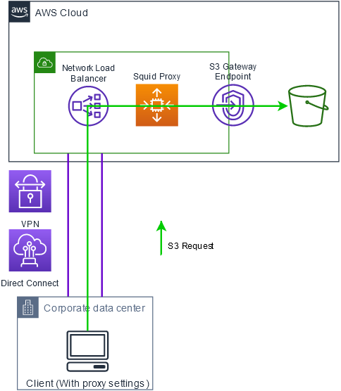

# Solution

Often when you connect to Amazon S3 you connect to Amazon S3 using the external Amazon S3 endpoints. However, some use cases might have the requirment to connect to Amazon S3 via a more controlled network using a VPN Connection or AWS Direct Connect (Private/Transit VIF) together with an Amazon VPC. Inside of a Amazon VPC, this can be solved using S3 Gateway Endpoints, but S3 Gateway Endpoint connections cannot be extended out of an Amazon VPC. So resources on the other side of a connections such as: a VPN connection, a VPC peering connection or an AWS Direct Connect connection cannot use the Gateway endpoint to communicate with Amazon S3 without doing a extra hop inside of the Amazon VPC where the Amazon S3 Gateway Endpoint is located.

This solution creates a sample HTTP proxy using Squid that will help you proxy requests so you can connect to an Amazon S3 bucket over an Amazon S3 Gateway Endpoint outside of an Amazon VPC. The proxy is deployed behind an Network Load Balancer(NLB) and while the initial deployment have a static amount of EC2 instances(proxies) behind the NLB, this can be scaled as all traffic is load balanced via the NLB.
The EC2 Instance role used by the proxies have a rather open IAM policy attached, I recommend that you tailor this policy to adhere The Principle of Least Privilege.



## Prerequisites

Prior to successfully deploying the solution in your AWS environment, please have the following deployed:

* An Amazon VPC with Subnets.
* Routes to an Internet Gateway or NAT Gateway in the Subnets where the proxy should be deployed.
* S3 Gateway Endpoint attached to the VPC and routes to the S3 Gateway Endpoints configured in the routing tables.

## Examples

### AWS CLI

1. Set HTTP_PROXY and HTTPS_PROXY equal to the HttpProxy output value from the Cloudformation template.
2. The AWS CLI will now use the proxy settings without any extra paremeters, eg: `aws s3 cp <your_file> s3://<your_bucket>/` should work.
For more info about using proxies for AWS CLI, have a look at: https://docs.aws.amazon.com/cli/latest/userguide/cli-configure-proxy.html

### DistCP

Use the ProxyAddress and ProxyPort Output value from the Cloudformation template:
`hadoop distcp -Dfs.s3a.proxy.host=<ProxyAddress> -Dfs.s3a.proxy.port=<ProxyPort> -Dfs.s3a.connection.ssl.enabled=true <source> <target>`

### Amazon S3 permission Policy example

The following Amazon S3 bucket policy only allows access to the specified bucket when the traffic comes from the specified Amazon S3 Gateway Endpoint

 ```json
{
    "Version": "2012-10-17",
    "Id": "Policy1415115909152",
    "Statement": [
        {
            "Sid": "Access-to-specific-VPCE-only",
            "Effect": "Deny",
            "Principal": "*",
            "Action": "s3:*",
            "Resource": "arn:aws:s3:::<Bucket-Name>/*",
            "Condition": {
                "StringNotEquals": {
                    "aws:SourceVpce": "<VPC-Endpoiint-Id>"
                }
            }
        }
    ]
}
```

## Test and validation

Testing is easiest using the AWS CLI.

1. Without setting any proxy variables, try to connect to your s3 bucket, eg: `aws s3 cp <your_file> s3://<your_bucket>/` from your client. This should not work.
2. Set HTTP_PROXY and HTTPS_PROXY equal to the HttpProxy output value (https://docs.aws.amazon.com/cli/latest/userguide/cli-configure-proxy.html).
3. Try to run the the same command again, eg: `aws s3 cp <your_file> s3://<your_bucket>/`. In a successful deployment, this will copy the file successfully to S3.

## Security

See [CONTRIBUTING](CONTRIBUTING.md#security-issue-notifications) for more information.

## License

This library is licensed under the MIT-0 License. See the LICENSE file.

